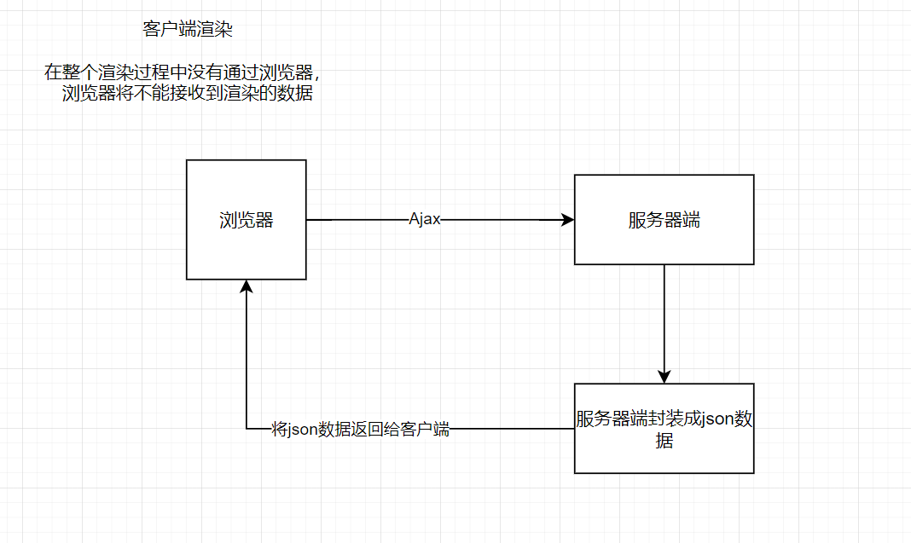

# Nuxt.js学习

## 简介

为什么要学习Nuxt.js，需求分析：

- 采用 vue.js 开发的应用系统SEO不友好，需要解决SEO的问题
- 比如：新闻门户、博客系统有SEO的需求，希望被搜索引擎收录，百度排名靠前等。

### 了解搜索引擎收录机制

利用搜索引擎的规则提高网站在有关搜索引擎内的自然排名。目的是让其在行业内占据领先地位，获得品牌收益。很大程度上是网站经营者的一种商业行为，将自己或自己公司的排名前移。

### 使用什么样的技术可以实现seo的优化

