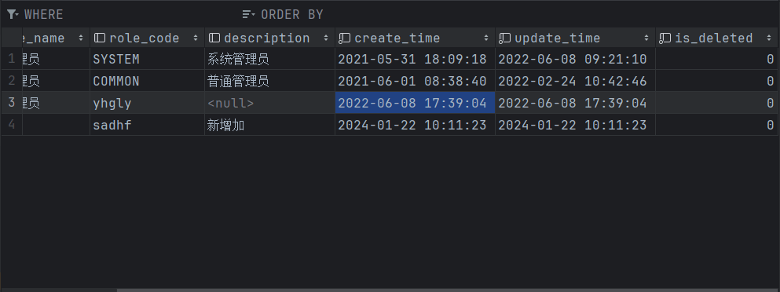
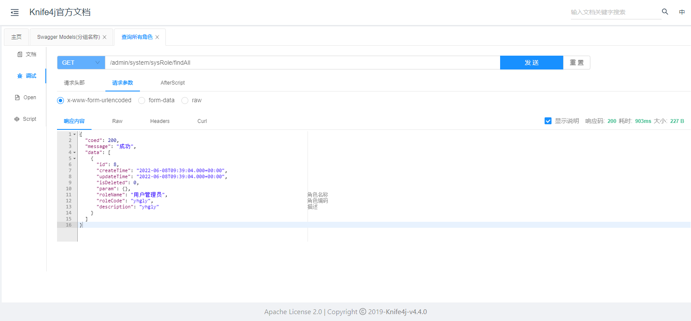

## mybatis实战

- 创建数据库 
- 执行已经提供的数据库文件 
- 创建springboot配置文件 
- 使用yaml格式的配置文件 
- 创建角色对应的实体类 
- 创建mapper映射接口，让这个接口继承BaseMapper 
- 创建启动类 - 进行增删改查测试

在运行过程中由于使用了jdk21的版本导致报错，原因是由于springboot2暂时不支持，切换为springboot3之后发现mybatis-plus不支持，导致出现错误，目前最新的mybatis-plus仍然不支持springboot3最新版本，后切换为jdk17，springboot2解决问题

```java
public enum IdType {
    AUTO(0), //主键自动增长
    NONE(1), //没有策略
    INPUT(2), //手动输入
    ASSIGN_ID(3), //生成一个唯一的策略
    ASSIGN_UUID(4), //生成一个唯一的策略
    /** @deprecated */
    @Deprecated
    ID_WORKER(3),
    /** @deprecated */
    @Deprecated
    ID_WORKER_STR(3),
    /** @deprecated */
    @Deprecated
    UUID(4);

    private final int key;

    private IdType(int key) {
        this.key = key;
    }

    public int getKey() {
        return this.key;
    }
}

```

在测试删除的时候我们使用的是逻辑删除的方式（在删除的时候数据还存在但是无法查询出来），将

```java
    @TableLogic //逻辑删除注解
    @TableField("is_deleted")
    private Integer isDeleted;
```

字段的值修改为1表示删除，下一次查询的时候就不会被查询，物理删除执行的时候将直接删除表中的数据



从查询所有的sql语句中也能看出mybatis-plus自动封装了逻辑删除的逻辑

```sql
SELECT id,role_name,role_code,description,create_time,update_time,is_deleted FROM sys_role WHERE is_deleted=0
```

```java
package cn.rlfit.auth;

import cn.rlfit.auth.mapper.SysRoleMapper;
import cn.rlfit.auth.service.SysRoleService;
import cn.rlfit.model.system.SysRole;
import com.baomidou.mybatisplus.core.conditions.query.LambdaQueryWrapper;
import com.baomidou.mybatisplus.core.conditions.query.QueryWrapper;
import org.junit.jupiter.api.Test;
import org.springframework.beans.factory.annotation.Autowired;
import org.springframework.boot.test.context.SpringBootTest;

import java.util.Arrays;
import java.util.List;

@SpringBootTest //spring提供的测试注解，包含基本上所有的测试包
public class TestMpDemo1 {


    //注入
    @Autowired
    private SysRoleMapper mapper;

    @Autowired
    SysRoleService service;

    @Test
    public void getAll() {
        List<SysRole> list = mapper.selectList(null); //查询所有数据并返回成一个集合
        System.out.println(list);
    }

    //插入
    @Test
    public void add() {
        mapper.insert(new SysRole("张三", "sadhf", "新增加"));
    }

    //更新
    @Test
    public void update() {
//        根据id查询
        SysRole role = mapper.selectById(9);
//        设置修改的值
        role.setRoleName("李四");
//        调用方法进行最终的修改
        mapper.updateById(role);
    }

    //逻辑删除
    @Test
    public void deleteById() {
        int i = mapper.deleteById(9);
    }


    //    批量删除
    @Test
    public void testDeleteBatchIds() {
        mapper.deleteBatchIds(Arrays.asList(1, 2));
    }

    //    条件查询
    @Test
    public void testQuery01() {
//        创建querywrapper对象，调用方法封装条件

        QueryWrapper<SysRole> wrapper = new QueryWrapper<>();
        wrapper.eq("role_name", "张三");
//        使用mapper执行查询操作
        List<SysRole> list = mapper.selectList(wrapper);
//        最终查询的时候什么都没有查询到，因为是被我们删除了
        System.out.println(list);
    }

    //     使用lambda表达式查询
    @Test
    public void lambdaQuery() {
        LambdaQueryWrapper<SysRole> lambdaQueryWrapper = new LambdaQueryWrapper<>();
        lambdaQueryWrapper.eq(SysRole::getRoleName, "总经理");
    }

    //    service方法
    @Test
    public void SGetAll() {
        List<SysRole> list = service.list();
        System.out.println(list);
    }
}

```

## 角色管理

- 前端：使用Ajax调用后端接口

- 后端：实现查询数据的接口

  - 角色查询所有

    ```java
    @RestController //融合注解，交给spring进行管理，返回json数据
    @RequestMapping("/admin/system/sysRole") //本类中基本的路径
    public class SysRoleController {
    
        @Autowired
        SysRoleService service; //注入service
    
        /**
         * 查询所有角色
         * @return 查询的所有角色的json数据
         */
        @GetMapping("/findAll")
        public List<SysRole> findAll() {
            List<SysRole> list = service.list();
            return list;
        }
    }
    ```

  - 定义统一返回结果对象

    - code:状态码

    - message:状态消息

    - data:返回的数据部分

    - ok:是否成功

      ```java
      package cn.rlfit.common.result;
      
      import lombok.Data;
      
      /**
       * @description: some desc
       * @author: sunjianrong
       * @email: sunruolifeng@gmail.com
       * @date: 22/01/2024 12:11 PM
       */
      
      @Data
      public class Result<T> {
          private Integer coed; //操作的状态码
          private String message; //是否成功
          private T data; //查询出来的具体数据
      
          //    构造私有化
          private Result() {
          }
      
          //    封装返回的数据
          public static <T> Result<T> build(T body, ResultCode resultCode) {
              Result<T> result = new Result<>();
              if (body != null) result.setData(body);
              result.setCoed(resultCode.getCode());
              result.setMessage(result.getMessage());
              return result;
          }
      
          //    成功
          public static <T> Result<T> ok() {
              return build(null, ResultCode.SUCCESS);
          }
      
          public static <T> Result<T> ok(T data) {
              return build(data, ResultCode.SUCCESS);
          }
      
          //    失败
          public static <T> Result<T> fail() {
              return build(null, ResultCode.FAIL);
          }
      
          public static <T> Result<T> fail(T data) {
              return build(data, ResultCode.FAIL);
          }
      
          //  自己手动扩展
          public Result<T> message(String msg) {
              this.setMessage(msg);
              return this;
          }
      
          public Result<T> code(Integer coed) {
              this.setCoed(coed);
              return this;
          }
      }
      ```

  - 整合框架knife4j

    为JavaMVC框架集成swagger生成api文档的增强解决方案

    https://doc.xiaominfo.com/docs/quick-start

    配置类详解：https://blog.csdn.net/m0_72568513/article/details/131018453

    

  - 条件分页查询角色

    - 配置分页插件
    - 编写分页方法
      - 参数：	
        - 分页参数（当前也和每一页显示的记录数）
        - 条件的参数
    - 调用service的方法实现最终的条件查询

  - 添加

  - 修改

  - 删除

    - 根据id
    - 批量删除
      - JSON数据格式
        - 对象格式{"",""}
        - 数组格式[]
        - Java中的对象会变成对象格式
        - Java中的数组会变成json的数组格式

  - 统一异常处理

    - 全局异常处理
      - 创建一个类，在类中添加上一个注解
      - 在类中添加执行的方法，在方法上添加一个注解，指定哪个异常出现的时候会执行（底层使用aop的方式）
    - 特定异常处理
    - 自定义异常处理
      - 创建异常类，继承RuntimeException
      - 在异常类中添加相关属性，异常的状态码，异常描述信息
      - 在出现异常的地方手动抛出异常
      - 在之前创建的异常类中添加执行的方法

## 前端调用接口得到数据展示

### es6入门

## 用户管理

### 用户的增删改查

### 用户的角色管理

显示所有角色

根据用户id查询用户角色关系表，根据关系表查询所有角色id，根据id查询角色信息

