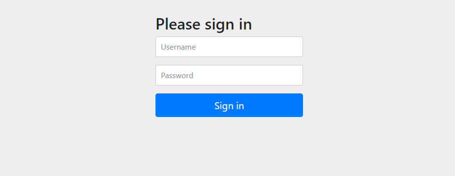

# SpringSecurity从入门到精通

> 大佬博客：https://zhuanlan.zhihu.com/p/365513384

springSecurity是一个spring家族中的安全框架，提供了丰富的功能，社区资源非常丰富

spring security 的核心功能主要包括：

- 认证 （你是谁） 通过注解 `@EnableWebSecurity`开启

  简单来说，就是需要登录，你需要输入用户名和密码，才能访问某个url。

- 授权 （你能干什么） 不需要通过指定的开关开启，而是通过配置来增加授权规则来生效，不增加授权规则就不生效

  授权的目的是可以把资源进行划分，例如公司有不同的资料，有普通级别和机密级别，只有公司高层才能看到机密级别的子类，而普通级别的资料大家都可以看到！ 那么授权就是允许你查看某个资源，当然，如果你没有权限，就拒绝你查看！

## 快速入门

搭建一个springboot工程

```xml
<?xml version="1.0" encoding="UTF-8"?>
<project xmlns="http://maven.apache.org/POM/4.0.0" xmlns:xsi="http://www.w3.org/2001/XMLSchema-instance"
         xsi:schemaLocation="http://maven.apache.org/POM/4.0.0 https://maven.apache.org/xsd/maven-4.0.0.xsd">
    <modelVersion>4.0.0</modelVersion>
    <parent>
        <groupId>org.springframework.boot</groupId>
        <artifactId>spring-boot-starter-parent</artifactId>
        <version>2.7.18</version>
        <relativePath/> <!-- lookup parent from repository -->
    </parent>
    <groupId>cn.rlfit</groupId>
    <artifactId>springSecurity</artifactId>
    <version>0.0.1-SNAPSHOT</version>
    <packaging>pom</packaging>
    <name>springSecurity</name>
    <description>springSecurity</description>
    <modules>
        <module>demo01</module>
    </modules>
    <properties>
        <java.version>17</java.version>
    </properties>
    <dependencies>
        <dependency>
            <groupId>org.springframework.boot</groupId>
            <artifactId>spring-boot-starter</artifactId>
        </dependency>
        <dependency>
            <groupId>org.springframework.boot</groupId>
            <artifactId>spring-boot-starter-web</artifactId>
        </dependency>
        <dependency>
            <groupId>org.springframework.boot</groupId>
            <artifactId>spring-boot-starter-test</artifactId>
            <scope>test</scope>
        </dependency>
        <dependency>
            <groupId>org.projectlombok</groupId>
            <artifactId>lombok</artifactId>
        </dependency>
    </dependencies>

    <build>
        <plugins>
            <plugin>
                <groupId>org.springframework.boot</groupId>
                <artifactId>spring-boot-maven-plugin</artifactId>
            </plugin>
        </plugins>
    </build>

</project>
```

创建启动类

 创建controller

## 引入springsecurity

```xml
        <dependency>
            <groupId>org.springframework.boot</groupId>
            <artifactId>spring-boot-starter-security</artifactId>
        </dependency>
```

重新启动web工程，访问接口发现我们并不能直接的进行接口访问：



这是框架给我们默认提供的登录页面。认证功能实现

默认的用户名是：user，默认的密码每一次都会自动的生成，如果你没有在配置文件中进行配置的话

```sh
Using generated security password: f44bb8f8-d0c3-4d16-97b1-642cc7a76a69

This generated password is for development use only. Your security configuration must be updated before running your application in production.

```

登录成功之后就可以继续访问接口

## 认证

### 登录验证流程


### 原理初探


原理其实就是一个过滤器链，内部包含了很多的功能，其中核心的过滤器包括以下几个


上面列出的过滤器只是其中的几个，在过滤器链中总共存在十多个过滤器，但是我们可以操作的基本上是以上几个


### 认证授权流程


Authentication接口: 它的实现类，表示当前访问系统的用户，封装了用户相关信息。
AuthenticationManager接口：定义了认证Authentication的方法
UserDetailsService接口：加载用户特定数据的核心接口。里面定义了一个根据用户名查询用户信息的
方法。
UserDetails接口：提供核心用户信息。通过UserDetailsService根据用户名获取处理的用户信息要封装
成UserDetails对象返回。然后将这些信息封装到Authentication对象中。

### 解决问题

- 我们如何在登录的时候查询我们自己的数据，而不是查询内存中的数据（在上图中的最后一个实现类中重写接口的实现方法，在方法中自定义查询数据的方式）
- 是不是每一次都需要查询数据，从数据库中获取信息和token进行比对呢（可以使用redis存储数据，之后的每一次查询都从redis中进行查询）

### 思路分析

登录：

- 自定义登录接口，调用provideManager去认证，如果认证通过生成jwt，将用户信息存储进入redis中
- 自定义userDetailService，在这个实现类中去查询数据库

校验：

- 定义jwt认证过滤器
  - 获取token，解析token，获取其中的userId，从redis中获取用户信息，存入SecurityContextHolder中

### 准备工作

添加依赖

创建UserDetils对象

实现对象

```java
public class UserDetailImpl implements UserDetail, UserDetailsService {
    /**
     * 注入mapper，从数据库查询用户信息，没有查询到用户信息就抛出异常
     *
     * @param username
     * @return
     * @throws UsernameNotFoundException
     */
    @Override
    public UserDetails loadUserByUsername(String username) throws UsernameNotFoundException {
//        查询用户信息
//        查询对应的权限信息
        return null;
    }
}
```

```java
package cn.rlfit.domain;

import org.springframework.security.core.GrantedAuthority;
import org.springframework.security.core.userdetails.UserDetails;

import java.util.Collection;

/**
 * @description: some desc
 * @author: sunjianrong
 * @email: sunruolifeng@gmail.com
 * @date: 28/01/2024 5:42 PM
 */
public class LoginUser implements UserDetails {
    @Override
    public Collection<? extends GrantedAuthority> getAuthorities() {
        return null;
    }

    @Override
    public String getPassword() {
        return null;
    }

    @Override
    public String getUsername() {
        return null;
    }

    @Override
    public boolean isAccountNonExpired() {
        return false;
    }

    @Override
    public boolean isAccountNonLocked() {
        return false;
    }

    @Override
    public boolean isCredentialsNonExpired() {
        return false;
    }

    @Override
    public boolean isEnabled() {
        return false;
    }
}

```

运行上述代码将会出错，是由于密码的校验方式错误导致的

### 密码加密存储

在实际的项目中我们不会将密码以铭文的方式存储在数据库中

默认使用的是